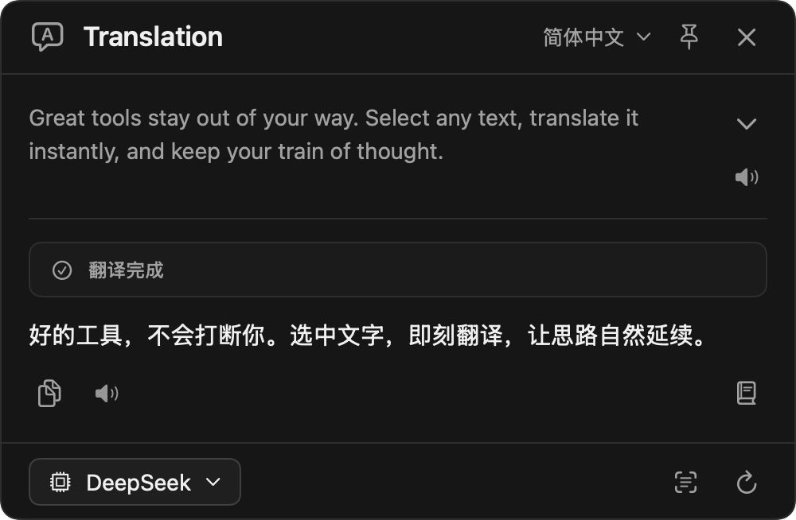
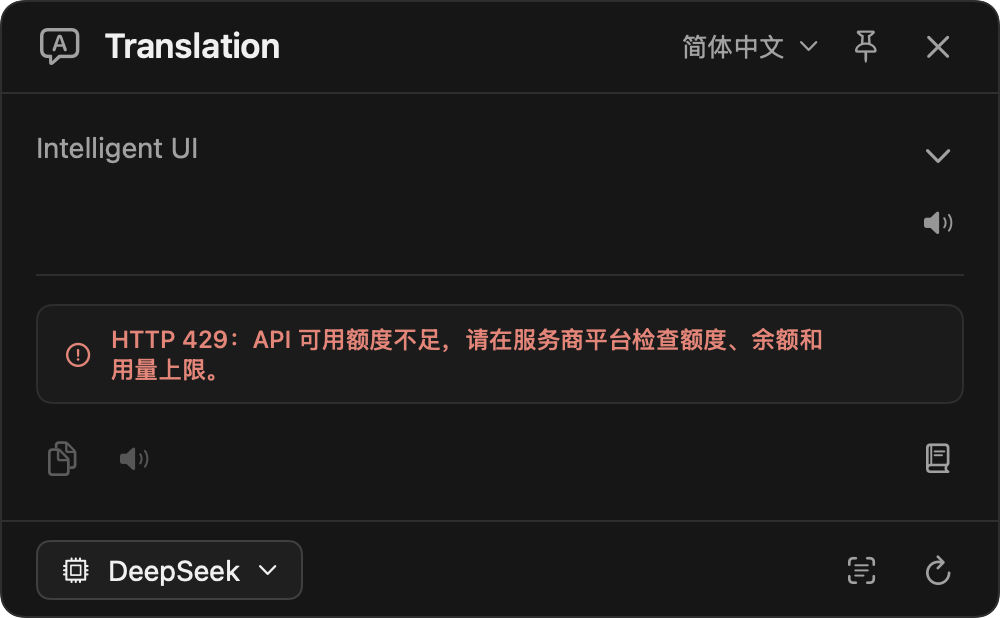

# TranslateHUD

> by [@jisi71](https://github.com/jisi71)

一款 macOS 菜单栏翻译工具。选中文字或框选屏幕区域，按下快捷键，即可在浮窗中查看译文；支持流式输出、原文与译文朗读，以及按需生成中文术语解释。

[下载最新版本](https://github.com/jisi71/TranslateHUD/releases/latest) · [v0.3.1 更新说明](docs/releases/v0.3.1.md)

## 界面预览



新版原生界面截图，使用示例文案。顶部切换目标语言、置顶或关闭窗口；中间查看原文、翻译状态和译文；底部查看当前 API 与模型、打开设置、展开上下文或重新翻译。

<details>
<summary>查看错误提示示例</summary>

以下截图使用模拟错误响应，展示提示排版与处理建议；具体错误含义以实际服务商返回为准。




</details>

## v0.3.1 更新

- **统一错误指引**：鉴权、余额、权限、接口参数、模型与服务端错误分别给出原因和处理建议；HTTP 402 明确提示“API 账户余额不足”。
- **区分限流和额度**：根据已知服务商错误码细分 HTTP 429，无法确定原因时保留中性提示；额度错误不会当作译文格式错误反复请求。
- **中文网络与超时提示**：区分断网、DNS、连接中断、TLS 和证书错误；说明请求等待、无新译文或总耗时超限，以及实际时间限制。
- **完整显示与隐私**：长提示完整换行，通知浮窗按内容调整高度与停留时间；名词解释不再显示服务响应正文，截图、OCR 与选区错误补充下一步操作。
- **减少界面等待**：API Key 改为按需从原钥匙串记录读取，普通浮窗渲染和配置校验不再触发凭据读取。

## v0.3.0 更新

- **全新深色翻译浮窗**：选中文字翻译与截图翻译使用统一布局，长文本在内容区滚动，顶部和底部操作栏保持可用。
- **常用操作集中显示**：在浮窗内切换目标语言并重新翻译，支持置顶、复制译文、朗读原文与译文、刷新，以及进入 API 设置。
- **查看原文上下文**：展开选中文字前后的文本并突出选中内容；应用未提供前后文时显示提示。截图翻译可按需展开原始截图。
- **TLS 中断自动恢复**：针对尚未出字时发生的特定 TLS 数据校验中断，自动重连并重试一次。网络恢复与质量重试共用每轮最多两次请求额度，保留系统代理和证书校验。
- **翻译可靠性与隐私改进**：完善空译文、缺失或重复索引、提前断开的流式响应校验；减少网址、路径和带中文释义的专名误报；诊断日志不再记录选中文字原文。

## 功能

- **截图翻译**：触发后拉起系统区域框选 → Vision OCR → LLM 翻译 → 原文与译文浮窗，原始截图可按需展开
- **翻译选中**：取当前选中文字（AX 优先，Cmd+C 兜底） → LLM **流式翻译**（边出字边显示，体感等同 DeepSeek 网页） → 浮窗贴在选区下方
- **原生朗读**：原文与译文可分别朗读/停止，优先使用 macOS 已安装的高级或增强 voice，支持中英文混读与语速调节
- **名词解释**：用户展开后才独立请求，最多用中文解释 5 个专有名词、缩写或领域术语
- **目标语言可配**：默认简体中文；当输入主体也是中文时自动反向翻译为英语
- **置顶与上下文**：置顶后选区浮窗不会因点击其他窗口而关闭；支持查看应用可读取的选中文字前后文
- **完整请求 UI**：触发即出 loading 浮窗，支持取消、一键重试；批量请求最多 45 秒，流式请求连续 45 秒无新译文或总耗时超过 120 秒时超时

两个功能共享同一个全局快捷键（默认 `option+w`），App 自动按上下文路由：

- 当前焦点应用有选中文字 → 走「翻译选中」
- 否则 → 走「截图翻译」

也可以在设置里把两个功能绑定到不同快捷键，互不影响。

## 系统要求

- macOS 14.0+
- 一个 OpenAI 兼容协议的 LLM 服务（OpenAI / DeepSeek / Kimi / 智谱 / 通义 / OpenRouter / 本地 Ollama / 自定义）
- 自己编译额外需要：Xcode 15+

## 安装（普通用户）

1. 从 [Releases](../../releases) 下载最新的 `TranslateHUD-*-universal.zip`
2. 双击解压 → 把 `TranslateHUD.app` 拖到 `/Applications/`
3. **首次打开必须右键 → 「打开」**（因为是 ad-hoc 签名，没经 Apple 公证）
   - 双击会被 macOS 拦下："无法验证开发者"
   - 右键点 .app → 选「打开」→ 弹窗确认 → 「打开」
   - 之后双击就能直接启动
4. 启动后进首次配置（[首次使用](#首次使用)）

> 公开安装包采用 ad-hoc 签名，未经过 Apple 公证。首次打开需按 macOS 的提示确认，辅助功能与屏幕录制权限仍需单独授权。

## 自己编译

```bash
# 1. 一次性配置：生成本地代码签名证书
#    （防止每次重编后 macOS TCC 系统视为新 App，吊销已授予的权限）
bash scripts/setup-signing.sh

# 2. 安装 xcodegen（一次性）
brew install xcodegen

# 3. 生成 Xcode 工程
cd /path/to/TranslateHUD
xcodegen generate

# 4. 构建、固定安装并启动稳定签名版本
./scripts/install-local.sh
```

也可以 `open TranslateHUD.xcodeproj` 在 Xcode 里 ⌘R 跑。

打 release 包：

```bash
bash scripts/build-release.sh
# 产物在 releases/TranslateHUD-<version>-universal.zip
```

## 首次使用

1. **授权权限**
   - 启动后：菜单栏 📖 → 「检查权限…」
   - 系统设置 → 隐私与安全性：把 TranslateHUD 在「辅助功能」和「屏幕录制」里都打开
   - GitHub Release 使用 ad-hoc 签名，升级版本后 macOS 可能要求重新确认权限
   - 自己编译并通过 `scripts/install-local.sh` 固定安装时使用稳定本地签名，后续重编不会反复丢权限
2. **配置 LLM**
   - 菜单栏 📖 → 「打开设置…」
   - 选预设服务商（自动填好 baseURL + 推荐 model）
   - 填 **API Key**（存于 macOS Keychain）
   - 点「发送测试翻译」验证
3. **可选：自定义快捷键**
   - 设置 → 快捷键 section，点录入框直接按下你想要的组合即可
4. **可选：下载高质量朗读声音**
   - 设置 → 朗读 → 「打开系统声音管理」，点击“系统声音”右侧的 `ⓘ`，下载“高音质”或“优化音质”voice
   - 返回 TranslateHUD 后刷新声音列表并试听

## 使用场景

| 场景 | 操作 |
|---|---|
| 翻译屏幕上某段文字（截图法） | 任意 App 按 `option+w` → 拖框 → 释放 → 译文浮窗居中 |
| 翻译选中文字（备忘录 / TextEdit / Safari 等原生 App） | 选中 → `option+w` → 译文浮窗贴在选区下方（AX 命中） |
| 翻译选中文字（Chrome / 飞书 / Claude / VSCode 等 Electron 类） | 选中 → `option+w` → 译文浮窗贴鼠标下方（AX 漏 → Cmd+C 兜底自动接力） |
| 切换目标语言 | 点击浮窗顶部语言菜单，选择后立即重新翻译 |
| 置顶浮窗 | 点击顶部图钉；选区浮窗置顶后，点击其他窗口仍会保留 |
| 查看上下文或截图 | 点击底部上下文按钮；选区翻译显示可读取的前后文，截图翻译显示原始截图 |
| 关闭浮窗 | 点击右上 X 或按 ESC；未置顶的选区浮窗也可通过点击窗口外关闭 |

同键模式下的路由顺序：**AX 重试 → Cmd+C（最多约 600ms）→ 截图**。无选区时按 Cmd+C 是 no-op（pasteboard.changeCount 不变 → 不读、不污染剪贴板管理器）；有选区时 Cmd+C 拿到原文后立即把原剪贴板还原回去。

## 已知限制

- 同键模式在 Electron 类应用里最多会等待约 600ms，以避免选区复制较慢时误开截图。如果需要完全独立的行为，可给截图和翻译选中设置不同快捷键。
- **Cmd+C 兜底路径会让你的剪贴板管理器（Maccy / Paste / Raycast 历史等）多记录一条变化**：流程是「复制选中文本 → 还原原剪贴板」，一次操作产生两次 pasteboard 变化。AX 命中时不会发生，只有走 Cmd+C 兜底（Chrome / 飞书 / Electron 等）时才有这个副作用——这是模拟 Cmd+C 路径无法消除的固有代价。无选区时不会触发（不复制就不还原）。
- 高级/增强朗读 voice 由 macOS 单独下载，会占用额外磁盘空间；未下载时自动回退到基础 voice。
- 选中文字的前后文依赖来源应用提供辅助功能文本；部分网页或应用只提供选中文字，此时会显示无法读取前后文的提示。

## 项目结构

```
TranslateHUD/
├── App/                # @main / AppDelegate / 菜单栏 UI
├── Hotkey/             # KeyboardShortcuts 注册 + ModeRouter 路由判断
├── Features/
│   ├── Screenshot/     # ScreenCaptureService / OCRService / FloatingScreenshotWindow / ScreenshotFlow
│   └── Selection/      # SelectionFetcher (AX + Cmd+C) / FloatingTranslationPopover / SelectionFlow
├── Translation/        # ProviderConfig / OpenAICompatibleTranslator / SettingsStore / KeychainHelper
├── Speech/             # AVSpeechSynthesizer / voice 选择 / 中英混读
├── Settings/           # SettingsView / SettingsWindowController
├── Permissions/        # PermissionManager (AX trust + 跳系统设置)
├── Shared/             # TranslationPanel / AppLog / ToastCenter / WindowRegistry / DiagnosticsRunner
└── Resources/          # Info.plist / Assets.xcassets
```

单元测试位于 `TranslateHUDTests/`，覆盖路由、选区抓取与上下文、翻译质量、错误分类与隐私、TLS 恢复与请求额度、取消与超时、名词解释、朗读分段和提示尺寸。

## 关键设计决策

- **路由策略**：`HotkeyManager` 注册两个 `KeyboardShortcuts.Name`，共用同一组合时 handler 会双触发；`HotkeyManager` 用 100ms debounce 合并，再交给 `ModeRouter` 按 AX 选区状态判路由。
- **稳定签名**：默认 ad-hoc 签名 (`-`) 每次重编 cdhash 变化，TCC 视为新 App，已授予的 AX/屏幕录制权限失效。`scripts/setup-signing.sh` 在 keychain 里建一份自签名 code-signing 证书，DR 改为 `cert leaf hash` 维度，重编不变。
- **OpenAI 兼容协议唯一后端**：所有支持 `/chat/completions` 接口的服务都能接（含本地 Ollama）；没单独写 Anthropic / Gemini 协议族。
- **AX 优先 + Cmd+C 兜底**：`SelectionFetcher.fetch()` 先尝试 AX（无副作用），失败时模拟 Cmd+C 嗅探剪贴板，**用完会把原剪贴板内容还原**。
- **同键模式三段降级 (AX → Cmd+C → 截图)**：AX 优先（无副作用、~10ms）；AX 漏掉再 Cmd+C 兜底（无选区时是 no-op，pasteboard 不会被污染；有选区时立刻还原原剪贴板）；都没拿到才走截图。

## 排错

- **快捷键没反应**：菜单 → 「诊断」看输出；查 Console.app 过滤 `subsystem == com.qi.TranslateHUD`
- **AX 失效（理论上不应该发生）**：菜单 → 「诊断」看 `AX trusted`；如显示 ❌ 但你已授权过 → 系统设置里删掉 TranslateHUD 旧条目重新添加
- **HTTP 错误**：设置 → 「发送测试翻译」可看到 HTTP 错误码和处理建议；不展示服务响应原文，避免泄漏私人内容
- **余额或额度不足**：402 提示检查 API 账户余额；429 会按已知错误码区分限流与额度不足。请按提示检查服务商平台的余额、额度和用量上限
- **网络与超时**：按提示检查网络、DNS 或代理；超时会说明是请求等待、连续无新译文还是总耗时超限。原文较长或模型响应较慢时，可缩短原文或更换模型
- **TLS 错误**：尚未出字时发生特定 TLS 数据校验中断，会显示“重试中”并自动重连一次；连续失败时可检查系统代理与网络后手动刷新。证书错误不会自动重试或绕过校验
- **质量校验失败**：最多请求两次；网址、路径和带中文说明的专名允许保留原样，真正未翻译的词、空译文和提前中断的流式响应仍会报错。可缩短原文或更换模型后重试
- **想清空所有配置**：

  ```bash
  defaults delete com.qi.TranslateHUD
  security delete-generic-password -s com.qi.TranslateHUD -a translation.apiKey
  ```

## 依赖

- [sindresorhus/KeyboardShortcuts](https://github.com/sindresorhus/KeyboardShortcuts) — 全局快捷键 + SwiftUI Recorder（SPM 自动拉取）

## License

[MIT](LICENSE) © 2026 [@jisi71](https://github.com/jisi71)
